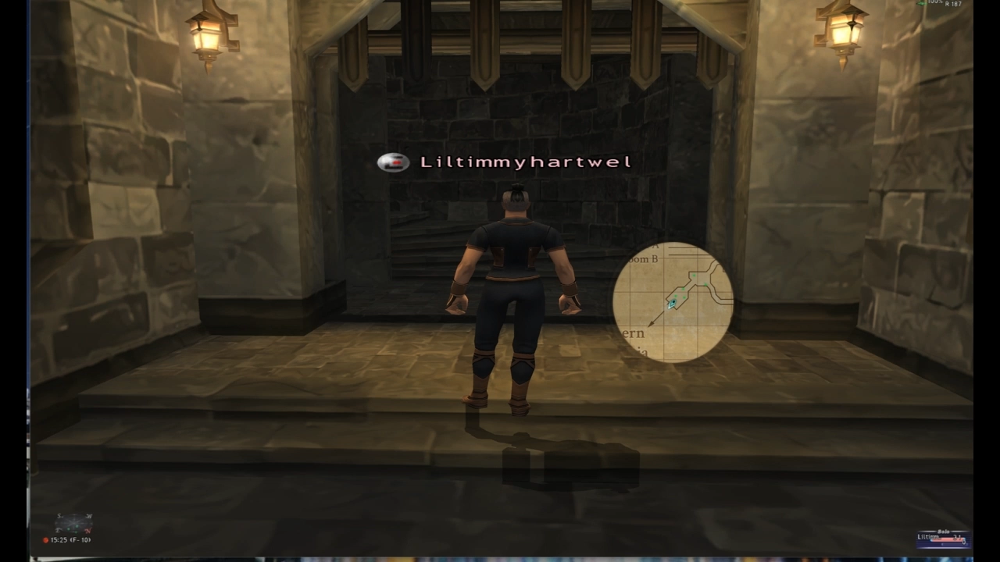

# ZoneBanners (Ashita v4)

A lightweight addon that shows a **PNG zone banner** when you zone in.

- **No text fallback / no small zone label**
- PNGs live in `zonebanners/assets/zones/<zoneId>.png`
- Banner timing and placement are configurable via Ashita settings

(https://github.com/user-attachments/assets/9f0f3609-2e26-4974-97dd-7494a35626a0)

## License

MIT (see `LICENSE`).
